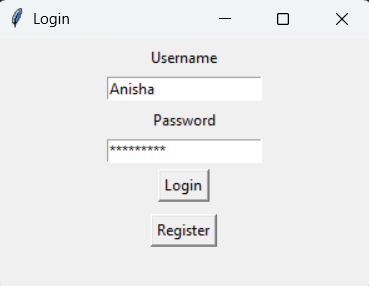
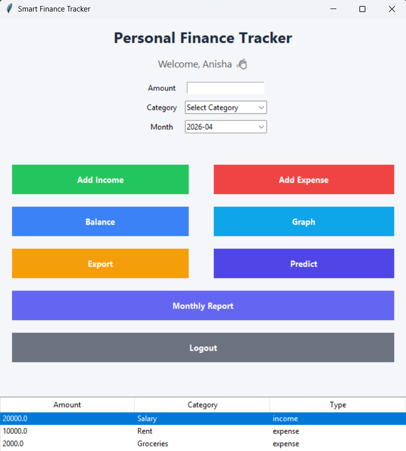
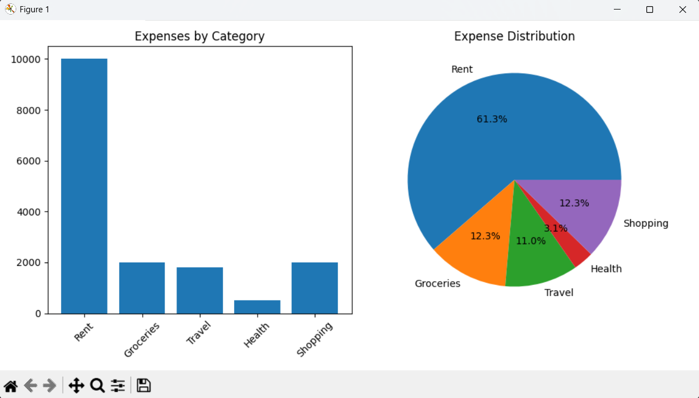

# 💰 Smart Finance Tracker

✨ A Python-based desktop application to manage personal finances with multi-user login, expense tracking, visual reports, and basic ML-based predictions.
💡 Designed to provide a simple yet intelligent way to monitor spending habits and improve financial decision-making.

---

## 🌐 Live Demo

🚀 **Click below to explore the project in action:**

👉 [Click here to view the live project](YOUR_VIDEO_LINK)

---

## 🚀 Features

* 👤 Multi-user login system
* 💰 Add Income & Expenses
* 📊 Monthly Financial Reports
* 📈 Graph Visualization (Bar & Pie Charts)
* 📁 Export Data to CSV
* 🤖 Basic ML-based Expense Prediction
* 🗄️ SQLite Database Integration

---

## 🛠️ Tools & Technologies Used

| Tool / Technology | Description                                                           |
| ----------------- | --------------------------------------------------------------------- |
| Python 🐍         | Core programming language used to build the application logic         |
| Tkinter 🖼️       | Used to create the graphical user interface (GUI)                     |
| SQLite 🗄️        | Lightweight database used to store user and transaction data          |
| Matplotlib 📊     | Used to generate graphs and visualize spending patterns               |
| Pandas 📦         | Used for data handling and preprocessing for analysis                 |
| Scikit-learn 🤖   | Used to implement basic machine learning model for expense prediction |
| CSV Module 📁     | Used to export transaction data into CSV files                        |
| Git & GitHub 🌐   | Used for version control and project hosting                          |

---

## 📸 Screenshots

### 🔐 Login Screen



### 📊 Dashboard



### 📈 Graph View



### 🤖 Prediction Popup


---

## ⚙️ How to Run

```bash
pip install -r requirements.txt
python gui.py
```

---

## 📊 How It Works

* User registers/logs in → gets a unique `user_id`
* All transactions are stored in SQLite database
* Data is filtered per user (multi-user support)
* Graphs help visualize spending patterns
* ML model predicts future expenses based on past data

---

## 📁 Project Structure

```
Smart-Finance-Tracker/
│
├── gui.py              # Main application UI
├── login.py            # Authentication system
├── database/           # Database handling
├── services/           # Business logic (ML, analytics, export)
├── models/             # Data models
├── reports/            # Graph generation
├── data/               # SQLite database
└── README.md
```

---

## 🔐 Data & Security

* User data is stored locally using SQLite
* Each transaction is linked with a unique `user_id`
* Ensures data separation between multiple users
* (Future improvement: password hashing for better security)

---

## 🌟 Why This Project Stands Out

* 💡 Combines GUI, Database, and Basic Machine Learning in one application
* 👥 Implements real-world multi-user authentication system
* 📊 Provides visual insights using graphs for better understanding
* 🤖 Includes intelligent expense prediction (beyond basic apps)
* 🧩 Clean and modular folder structure (industry-style design)

---

## 🎯 Key Highlights

* 📌 Beginner-friendly yet practical real-world application
* 📌 Demonstrates full-stack logic (UI + Backend + Database + ML)
* 📌 Designed with scalability in mind
* 📌 Strong project for academic and placement use

---

## 🚀 Future Improvements

* 🔐 Password hashing for enhanced security
* 📱 Mobile application version
* ☁️ Cloud database integration
* 📊 Advanced ML prediction model
* 📉 Budget alerts & smart recommendations

---

## 🧾 Conclusion

This project demonstrates how GUI development, database management, and basic machine learning can be integrated to build a practical and user-friendly finance management system. It provides a strong foundation for developing more advanced intelligent financial applications.

---

## ⭐ Support & Feedback

If you found this project useful or interesting:

👉 ⭐ **Please consider giving it a star on GitHub!**
👉 💬 Feel free to share feedback or suggestions

---

## 👩‍💻 Author

**Anisha Todkar**

---

✨ *Thank you for checking out this project!*
